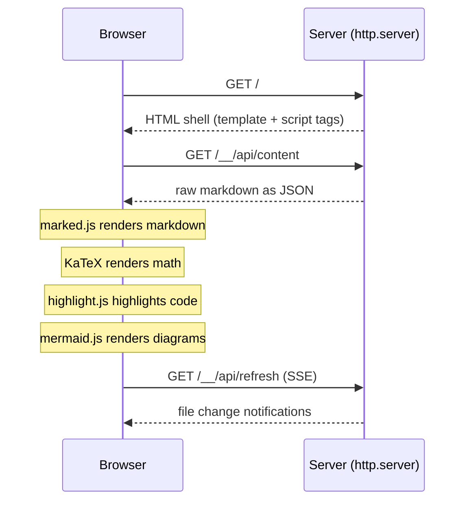

# Markdraft

Preview local markdown files in the browser with GitHub-flavored
rendering, mermaid diagrams, math, syntax highlighting, and live reload.
Zero runtime dependencies.

```console
$ draft README.md
 * Serving on http://localhost:6419/
```


## Installation

### From PyPI

```console
pip install markdraft
```

Or with [uv](https://docs.astral.sh/uv/):

```console
uv tool install markdraft
```

### Standalone executable

Download `markdraft.pyz` from
[Releases](https://github.com/imofftoseethewizard/markdraft/releases)
and run it directly — no installation needed:

```console
python markdraft.pyz README.md
```

Requires Python 3.10+. On first run, markdraft downloads about 3.5 MB
of JavaScript libraries from [jsDelivr](https://www.jsdelivr.com/) and
caches them in `~/.markdraft/`.


## Usage

Preview a file:

```console
$ draft README.md
 * Serving on http://localhost:6419/
```

Preview a directory (serves its README.md):

```console
$ draft .
```

Open the browser automatically:

```console
$ draft -b README.md
```

Specify host and port:

```console
$ draft README.md 0.0.0.0:8080
```

Export to a self-contained HTML file:

```console
$ draft --export README.md
Exporting to README.html
```

Export with CDN links instead of inlined assets:

```console
$ draft --export --no-inline README.md
```

Dark mode:

```console
$ draft --theme=dark README.md
```

The `mdraft` command is also available as an alias, for environments
where `draft` conflicts with [Azure Draft](https://github.com/Azure/draft).


## Features

- **Live reload** — file changes are detected and the browser refreshes
  automatically via Server-Sent Events
- **Mermaid diagrams** — ` ```mermaid ` fenced code blocks rendered by
  [mermaid.js](https://mermaid.js.org/)
- **Math/LaTeX** — `$inline$` and `$$display$$` math rendered by
  [KaTeX](https://katex.org/)
- **Syntax highlighting** — code blocks highlighted by
  [highlight.js](https://highlightjs.org/)
- **GitHub Alerts** — `> [!NOTE]`, `> [!TIP]`, `> [!IMPORTANT]`,
  `> [!WARNING]`, `> [!CAUTION]` styled callout boxes
- **Task lists** — `- [x]` and `- [ ]` checkboxes
- **GitHub styling** — rendered with
  [github-markdown-css](https://github.com/sindresorhus/github-markdown-css)
- **Export** — self-contained HTML files with all assets inlined or
  linked via CDN
- **Zero dependencies** — no pip runtime dependencies; rendering is
  done client-side by cached JavaScript libraries
- **Dark mode** — `--theme=dark` for dark color scheme
- **Standalone executable** — download a single `.pyz` file, no
  installation required


## CLI Reference

```
usage: draft [-h] [-V] [--user-content] [--wide] [--clear] [--export]
             [--no-inline] [-b] [--title TITLE] [--norefresh] [--quiet]
             [--theme THEME]
             [path] [address]
```

| Flag | Description |
|------|-------------|
| `path` | File or directory to render (`-` for stdin) |
| `address` | `host:port` to listen on, or output file for `--export` |
| `-b, --browser` | Open browser tab after server starts |
| `--export` | Export to HTML file instead of serving |
| `--no-inline` | Use CDN links instead of inlining assets in export |
| `--title TITLE` | Override the page title |
| `--theme THEME` | Color theme: `light` (default) or `dark` |
| `--user-content` | Render as GitHub issue/comment style |
| `--wide` | Wide layout (with `--user-content`) |
| `--norefresh` | Disable auto-refresh on file change |
| `--quiet` | Suppress terminal output |
| `--clear` | Clear the cached assets and exit |
| `-V` | Show version and exit |


## Python API

```python
from markdraft import serve, export, clear_cache

# Start a preview server
serve("README.md", port=8080, browser=True)

# Export to HTML
export("README.md", out_filename="preview.html")

# Clear cached CDN assets
clear_cache()
```


## Configuration

Create `~/.markdraft/settings.py` to override defaults:

```python
HOST = "0.0.0.0"
PORT = 8080
AUTOREFRESH = True
QUIET = False
```

The `MARKDRAFT_HOME` environment variable overrides the config directory
(default `~/.markdraft`).


## Architecture

Markdraft is a thin HTTP server built on Python's `http.server`. It
serves raw markdown via a JSON API and lets the browser handle all
rendering:



Modules:

| Module | Purpose |
|--------|---------|
| `markdraft/server.py` | HTTP server with routing |
| `markdraft/readers.py` | File/directory/stdin reading |
| `markdraft/assets.py` | CDN asset downloading and caching |
| `markdraft/export.py` | Self-contained HTML export |
| `markdraft/watcher.py` | File change detection for auto-refresh |
| `markdraft/browser.py` | Browser tab opening |
| `markdraft/config.py` | Constants, CDN URLs, settings loader |
| `markdraft/command.py` | CLI argument parsing |


## Development

```console
git clone https://github.com/imofftoseethewizard/markdraft
cd markdraft
uv sync
uv run pytest              # 148 tests, ~8s parallel
uv run pyright markdraft/  # type checking
uv run black markdraft/ tests/  # formatting
```


## Acknowledgments

Markdraft began as a fork of [Grip](https://github.com/joeyespo/grip)
by [Joe Esposito](https://github.com/joeyespo). Grip is a well-crafted
tool for previewing GitHub-flavored markdown locally, and its reader
abstractions and CLI design informed markdraft's architecture.

### Major changes from Grip

- **Zero runtime dependencies** — Grip depends on Flask, Markdown,
  Pygments, requests, docopt, path-and-address, and Werkzeug. Markdraft
  has no pip dependencies; it uses only the Python standard library.
- **Client-side rendering** — Grip renders markdown server-side with
  Python. Markdraft serves raw markdown and renders it in the browser
  with [marked.js](https://github.com/markedjs/marked),
  [highlight.js](https://github.com/highlightjs/highlight.js), and
  [mermaid.js](https://github.com/mermaid-js/mermaid).
- **Math/LaTeX support** — `$inline$` and `$$display$$` math via
  [KaTeX](https://katex.org/).
- **GitHub Alerts** — `> [!NOTE]`, `> [!WARNING]`, etc. rendered as
  styled callout boxes.
- **Mermaid diagram support** — ` ```mermaid ` fenced code blocks
  rendered as diagrams.
- **stdlib HTTP server** — replaces Flask with
  `http.server.ThreadingHTTPServer`.
- **Modern Python** — requires Python 3.10+, full type annotations,
  no Python 2 compatibility code.
- **uv project management** — `pyproject.toml` with hatchling build
  backend, managed by [uv](https://docs.astral.sh/uv/).
- **Security hardening** — path traversal protection via
  `Path.relative_to()`, symlink escape prevention, case-insensitive
  `</script>` escaping in exports.
- **Standalone executable** — downloadable `.pyz` file, no installation
  required.
- **GitHub API removed** — Grip's primary mode was to POST markdown to
  the GitHub API for rendering. Markdraft renders entirely offline.


## License

MIT
