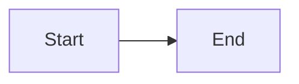
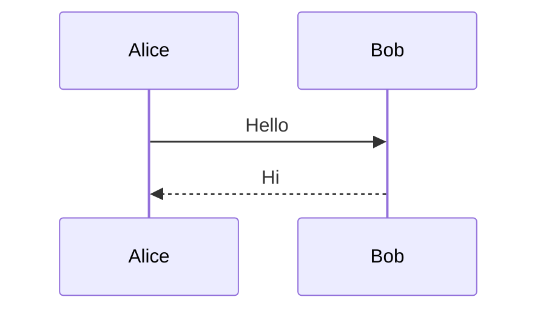

Gripper -- Grip with Mermaid Diagrams
======================================

A fork of [Grip](https://github.com/joeyespo/grip) that renders
` ```mermaid ` fenced code blocks as inline SVG diagrams.

Everything else works exactly like stock Grip: render local readme files
before sending off to GitHub, with styles and rendering that come directly
from GitHub so you'll know exactly how it will appear. Changes you make
to the Readme will be instantly reflected in the browser without requiring
a page refresh.

Gripper defaults to **offline rendering** with mermaid support, so no
GitHub API key is needed for basic usage.


Installation
------------

Install in a devcontainer (recommended) or any environment with Python 3.12+,
Node 20+, and Chromium:

```console
$ pip install -e '.[tests]'
$ npm install -g @mermaid-js/mermaid-cli
```


Usage
-----

To render the readme of a repository:

```console
$ cd myrepo
$ gripper
 * Running on http://localhost:6419/
```

Now open a browser and visit [http://localhost:6419](http://localhost:6419/).
Or run with `-b` and Gripper will open a new browser tab for you.

You can also specify a port:

```console
$ gripper 80
 * Running on http://localhost:80/
```

Or an explicit file:

```console
$ gripper AUTHORS.md
 * Running on http://localhost:6419/
```

You can combine the previous examples. Or specify a hostname instead of a port. Or provide both.

```console
$ gripper CHANGES.md 0.0.0.0
 * Running on http://0.0.0.0:6419/
```

You can even bypass the server and **export** to a single HTML file, with all the styles and assets inlined:

```console
$ gripper --export
Exporting to README.html
```

Control the output name with the second argument:

```console
$ gripper README.md --export index.html
Exporting to index.html
```


### Mermaid diagrams

Any fenced code block with the `mermaid` language tag is automatically
rendered as an inline SVG diagram:

````markdown



````

If `mmdc` is not available or rendering fails, the raw mermaid source is
shown as a code block instead.


### GitHub API rendering

The original `grip` command is still available and works exactly as before,
defaulting to the GitHub Markdown API renderer. Use it when you need
pixel-perfect GitHub rendering and have API credentials configured:

```console
$ grip --user <your-username> --pass <your-password>
```

Or use a [personal access token][]:

```console
$ grip --pass <token>
```

You can persist these options [in your local configuration](#configuration).


Architecture
------------

Gripper adds a `GripperRenderer` class (`grip/mermaid.py`) that subclasses
the existing `OfflineRenderer`. Its rendering pipeline:

1. **Extract** mermaid fenced code blocks from raw markdown via regex
2. **Replace** each with a unique placeholder that survives markdown rendering
3. **Render** the remaining markdown to HTML via the parent `OfflineRenderer`
4. **Convert** each mermaid block to SVG by shelling out to `mmdc` (mermaid-cli)
5. **Substitute** the SVG (wrapped in `<div class="mermaid-diagram">`) back
   into the HTML, replacing placeholders

The full rendering pipeline is:

```
reader.read(subpath)
  -> GripperRenderer.render(text, auth)
       -> extract mermaid blocks
       -> OfflineRenderer.render(remaining text)
       -> mmdc (mermaid blocks -> SVG)
       -> substitute SVGs for placeholders
  -> Flask template (index.html) via {{ content|safe }}
```

`GripperRenderer` is the default renderer. No GitHub API calls are made
unless you explicitly use `GitHubRenderer`.


Configuration
-------------

To customize Gripper, create `~/.grip/settings.py`, then add one or more of the following variables:

- `HOST`: The host to use when not provided as a CLI argument, `localhost` by default
- `PORT`: The port to listen on, `6419` by default
- `DEBUG`: Whether to use Flask's debugger when an error happens, `False` by default
- `DEBUG_GRIP`: Prints extended information when an error happens, `False` by default
- `API_URL`: Base URL for the GitHub API, for example that of a GitHub Enterprise instance. `https://api.github.com` by default
- `CACHE_DIRECTORY`: The directory, relative to `~/.grip`, to place cached assets, `'cache-{version}'` by default
- `AUTOREFRESH`: Whether to automatically refresh the Readme content when the file changes, `True` by default
- `QUIET`: Do not print extended information, `False` by default
- `STYLE_URLS`: Additional URLs that will be added to the rendered page, `[]` by default
- `USERNAME`: The user to authenticate with GitHub, `None` by default
- `PASSWORD`: The password or [personal access token][] to authenticate with GitHub, `None` by default


#### Environment variables

- `GRIPHOME`: Specify an alternative `settings.py` location, `~/.grip` by default
- `GRIPURL`: The URL of the Grip server, `/__/grip` by default


API
---

You can access the API directly with Python, using it in your own projects:

```python
from grip import serve

serve(port=8080)
 * Running on http://localhost:8080/
```

Or access the underlying Flask application for even more flexibility:

```python
from grip import create_app

app = create_app(user_content=True)
```

The `GripperRenderer` can also be used standalone:

```python
from grip import GripperRenderer

renderer = GripperRenderer()
html = renderer.render('# Hello\n\n```mermaid\ngraph LR\n    A-->B\n```')
```

See the upstream [Grip documentation](https://github.com/joeyespo/grip)
for the full API reference.


Testing
-------

Install the package and test requirements:

```console
$ pip install -e .[tests]
```

Run tests with [pytest][]:

```console
$ pytest
```

Verify mermaid rendering manually:

```console
$ gripper tests/mermaid_test.md
```

The rendered page should show two SVG diagrams inline with the surrounding text.


Devcontainer
------------

The `.devcontainer/` is configured with:

- Python 3.12
- Node 20
- Chromium + puppeteer dependencies
- `pip install -e '.[tests]'` and `npm install -g @mermaid-js/mermaid-cli` on create
- Port 6419 forwarded

Open the repo in a devcontainer to develop and test.


Contributing
------------

1. Check the open issues or open a new issue to start a discussion around
   your feature idea or the bug you found
2. Fork the repository and make your changes
3. Open a new pull request


[personal access token]: https://github.com/settings/tokens/new?scopes=
[pytest]: http://pytest.org/
