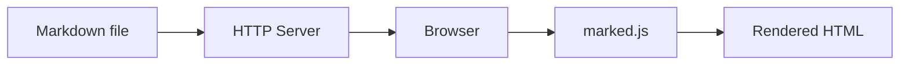

# Rendering Showcase

Run `draft tests/SHOWCASE.md` to verify every client-side rendering
feature works. Each section below exercises a different library.

## Syntax highlighting

```python
def fibonacci(n: int) -> int:
    a, b = 0, 1
    for _ in range(n):
        a, b = b, a + b
    return a
```

## Mermaid diagrams



## Math / LaTeX

Euler's identity: $e^{i\pi} + 1 = 0$

The Gaussian integral:

$$\int_{-\infty}^{\infty} e^{-x^2} \, dx = \sqrt{\pi}$$

## GitHub Alerts

> [!NOTE]
> This is a note — useful for supplementary information.

> [!TIP]
> This is a tip — helpful advice for the reader.

> [!IMPORTANT]
> This is important — key information the reader should know.

> [!WARNING]
> This is a warning — something that could cause problems.

> [!CAUTION]
> This is a caution — potential for data loss or security risk.

## GeoJSON maps

```geojson
{
  "type": "FeatureCollection",
  "features": [
    {
      "type": "Feature",
      "geometry": {
        "type": "Polygon",
        "coordinates": [[
          [-122.42, 37.78], [-122.42, 37.77], [-122.41, 37.77],
          [-122.41, 37.78], [-122.42, 37.78]
        ]]
      },
      "properties": { "name": "San Francisco" }
    }
  ]
}
```

## STL 3D models

> [!NOTE]
> GitHub has its own STL viewer for `.stl` files but does not render
> inline ASCII STL in fenced code blocks. This section only renders
> correctly in markdraft.

```stl
solid cube
  facet normal 0 0 -1
    outer loop
      vertex 0 0 0
      vertex 1 0 0
      vertex 1 1 0
    endloop
  endfacet
  facet normal 0 0 -1
    outer loop
      vertex 0 0 0
      vertex 1 1 0
      vertex 0 1 0
    endloop
  endfacet
  facet normal 0 0 1
    outer loop
      vertex 0 0 1
      vertex 1 1 1
      vertex 1 0 1
    endloop
  endfacet
  facet normal 0 0 1
    outer loop
      vertex 0 0 1
      vertex 0 1 1
      vertex 1 1 1
    endloop
  endfacet
  facet normal 0 -1 0
    outer loop
      vertex 0 0 0
      vertex 1 0 1
      vertex 1 0 0
    endloop
  endfacet
  facet normal 0 -1 0
    outer loop
      vertex 0 0 0
      vertex 0 0 1
      vertex 1 0 1
    endloop
  endfacet
  facet normal 1 0 0
    outer loop
      vertex 1 0 0
      vertex 1 0 1
      vertex 1 1 1
    endloop
  endfacet
  facet normal 1 0 0
    outer loop
      vertex 1 0 0
      vertex 1 1 1
      vertex 1 1 0
    endloop
  endfacet
  facet normal 0 1 0
    outer loop
      vertex 0 1 0
      vertex 1 1 0
      vertex 1 1 1
    endloop
  endfacet
  facet normal 0 1 0
    outer loop
      vertex 0 1 0
      vertex 1 1 1
      vertex 0 1 1
    endloop
  endfacet
  facet normal -1 0 0
    outer loop
      vertex 0 0 0
      vertex 0 1 0
      vertex 0 1 1
    endloop
  endfacet
  facet normal -1 0 0
    outer loop
      vertex 0 0 0
      vertex 0 1 1
      vertex 0 0 1
    endloop
  endfacet
endsolid cube
```

## Task lists

- [x] Syntax highlighting
- [x] Mermaid diagrams
- [x] Math / LaTeX
- [x] GitHub Alerts
- [x] GeoJSON maps
- [x] STL 3D models
- [x] Task lists
- [ ] Emoji shortcodes (not yet supported)

## Tables

| Library | Purpose | Size |
|---------|---------|------|
| marked.js | Markdown rendering | 40 KB |
| highlight.js | Syntax highlighting | 40 KB |
| KaTeX | Math rendering | 270 KB |
| mermaid.js | Diagrams | 2.9 MB |
| Leaflet | GeoJSON maps | 148 KB |
| Three.js | STL 3D models | 670 KB |
